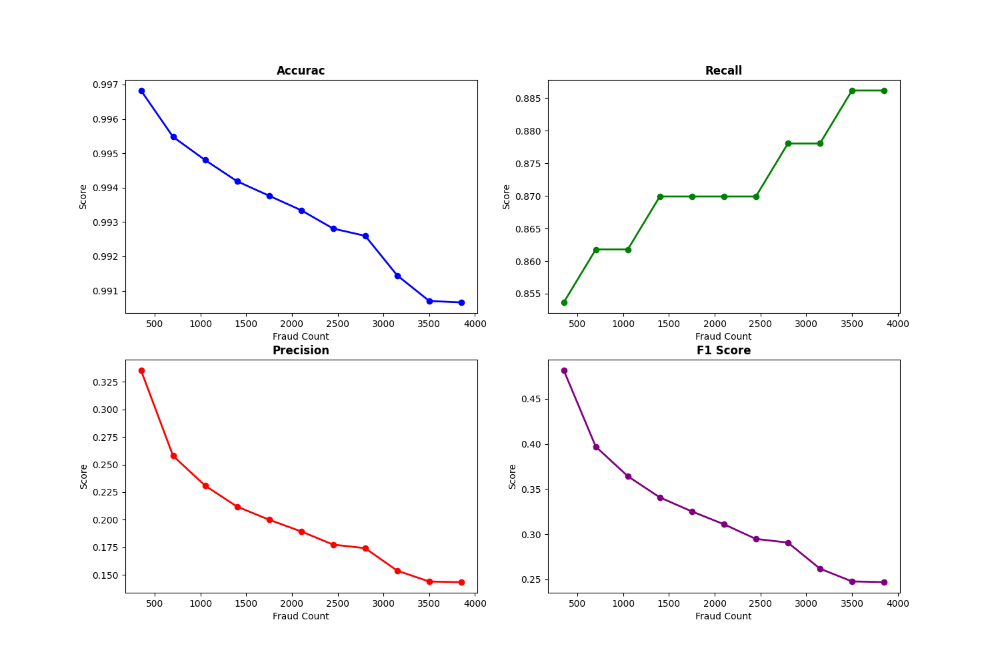
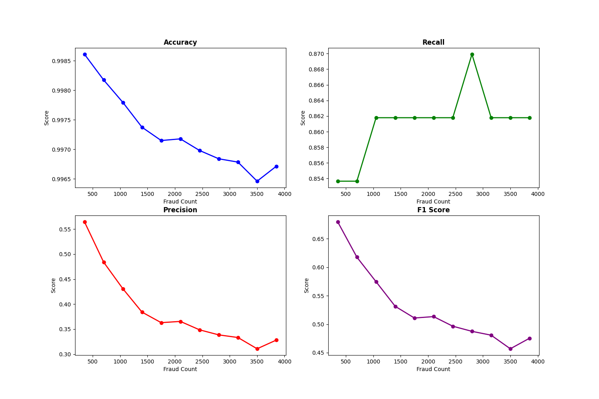
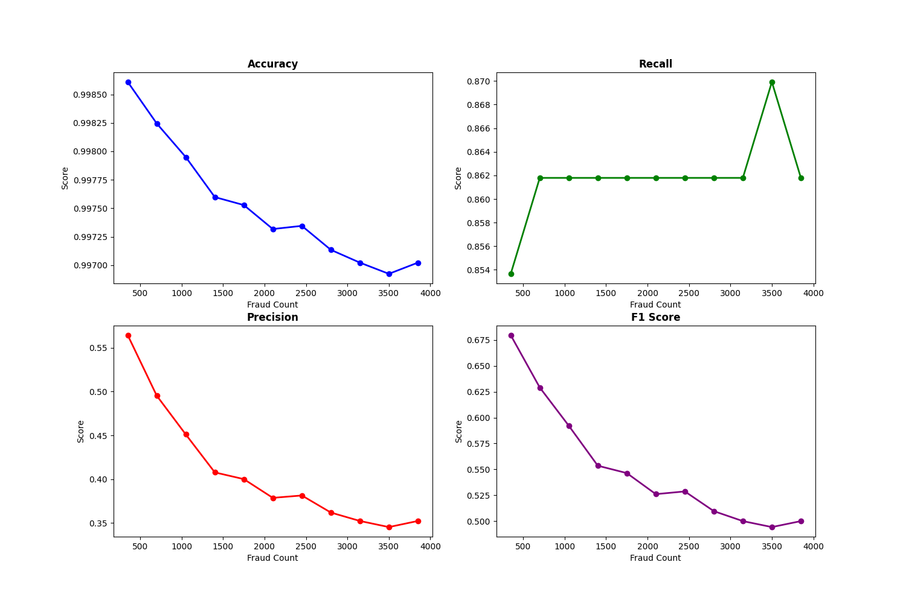
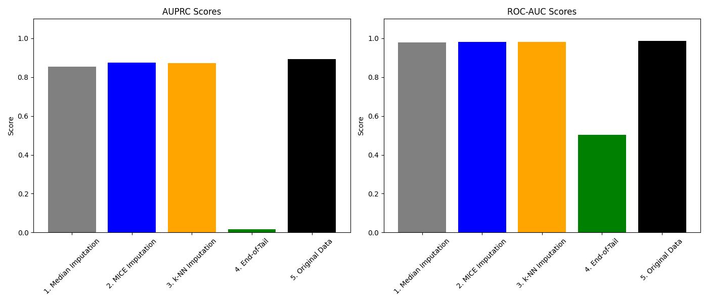
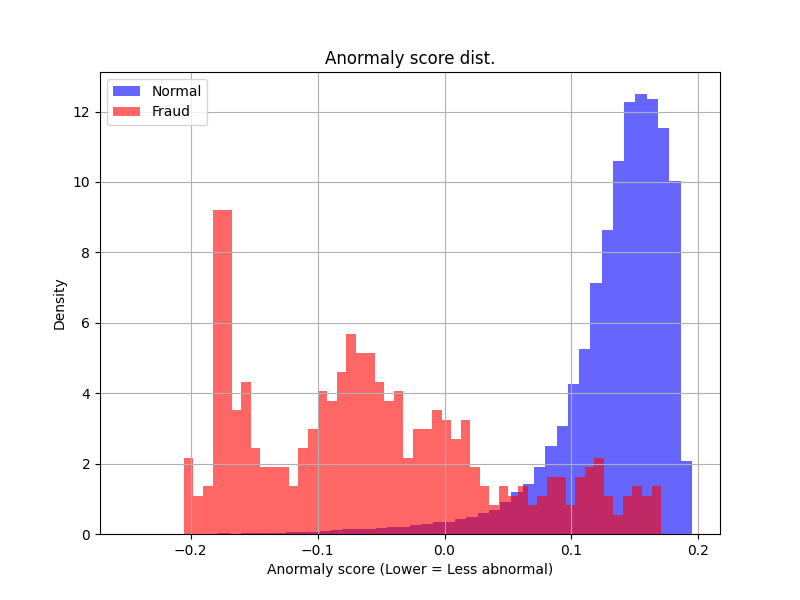
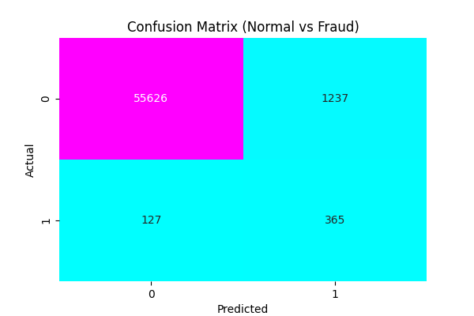
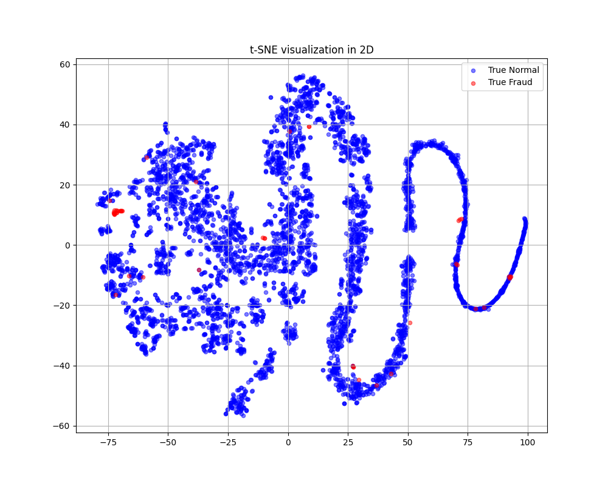
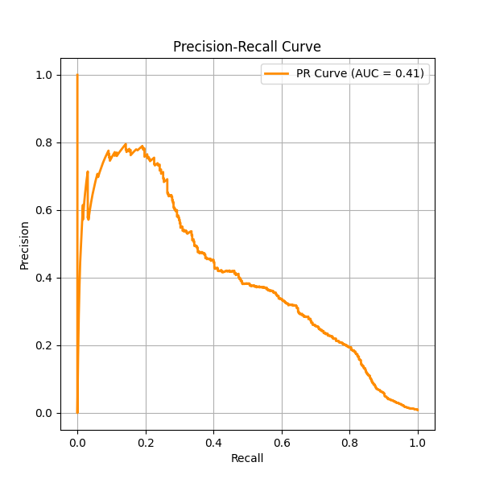

# Credit Card Fraud Detection

The repository of a Machine Learning project for the course SE3007.

## About This Project

This project aims to distinguish whether a credit card transaction is fraud or authentic. Our machine learning methods had to perform through unique challanges because of the highly imbalanced dataset. This makes the task challenging because models must detect rare positive cases without producing too many false positives. As a team, we implemented 4 different machine learning methods:

- SMOTE (Synthetic Minority Over Sampling) Technique
- PCA (Principal Component Analysis) Technique
- Missing Value Imputation Technique
- Outlier Technique

## About The Dataset

We used the [Credit Card Fraud Detection](https://www.kaggle.com/datasets/mlg-ulb/creditcardfraud), from Kaggle. The dataset has logs of credit card transactions which can either be normal or fraud.

- Total Transactions : 284,807
- Fraud Transactions : 492 (0.172% of total)
- Format : numerical
- Total Features : 30 (background information only available for Time and Amount, because of confidentiality)

-----

## How To Replicate

To replicate this experiments, simply clone this repository, install the .csv file and place it in the folder associated with the experiment you want to do.

In some parts, the models and plots will be saved in specific folders for ease of use.

## SMOTE (Synthetic Minority Over Sampling) Technique

In real world; there are datasets where the data is so unbalanced, we need to create synthetic datas. In this part, we applied SMOTE algorithm in order to create fake data and see how various techniques behave with this synthetic data.

### Methodology

We used two types of algorithms: SMOTE and Borderline_SMOTE. The main principle of these algorithms are creating fake data by using what's already in the k nearest neighbors. Borderline_SMOTE has a similar way of working. It looks at the neaarest boundary between classes.

### Results

The results for this task are somehow expected. In the following plots, we can see how the models behave with increasingly more fake "fraud" data.

These plots show how the test data performed based on fake "fraud" count in the training dataset used to train them.

#### SMOTE + Logistic Regression

As we can see in this plot, the accuracy is a lie. We can clearly see presicion and f1-score going down as the fake "fraud" count increase. Which means the model is not able to differentiate between "real" or "fraud" transactions.

#### Borderline_SMOTE + Logistic Regression

In this plot, we can see mostly same things as the regular SMOTE. One thing to notice is how the recall goes up gradually instead of going to the top really fast. This tells us Borderline_SMOTE creates data that does not distrupt how "fraud" data are distributed along the dataset.

#### SMOTE + Random Forest

In this plot, we can see the difference between Logistic Regression and Random Forest clearly. the presicion and F1-Score is significantly higher than Logistic Regression. This means Random Forest is better at telling the difference between "real" and "fraud" data.

In this plot, we can see how changing the algorithm from normal SMOTE to Borderline_SMOTE did not make significant changes to the Random Forest model. Only difference is recall spikes at the 3500 "fraud" mark instead of 2500. This might be because how Borderline_SMOTE creates fake data.

### Conclusion

In these plots, we can see how adding synthetic values to the dataset might not be the best approach in solving the "unbalanced" issue. Even the smallest addition to the dataset can make the model perform worse than before due to the noise in every new data. If necessary, adding about 500-1000 values might be the best since the drop in values is minimal.

-----

## PCA (Principal Component Analysis) Technique

To study how dimensionality reduction affects model behavior, we applied Principal Component Analysis (PCA) using 95% variance retention, which reduced the dataset from 30 original features to 27 principal components. We then compared the performance of several machine learning algorithms before and after PCA using the exact same workflow.
The goal of this report is to analyze how PCA influences accuracy, precision, recall, and F1-score, and to explain why each model’s performance improved, decreased, or stayed similar after dimensionality reduction.

### Methodology

We used the same workflow for all algorithms to ensure a fair comparison.

1. Data Loading & Splitting:
The dataset was loaded from creditcard.csv. Features (X) and labels (y) were separated, then split into 80% training and 20% testing using stratified sampling.

2. Feature Scaling:
All features were standardized using StandardScaler (fit on training data, applied to test data).

3. PCA Transformation (95% Variance):
PCA was applied to the scaled training data, reducing 30 features → 27 components. The same transformation was applied to the test set.

4. Model Training (Before and After PCA):
For each algorithm (XGBoost, MLP, SVM, KNN), we trained:

- A model on the original scaled features
- A model on the PCA-reduced features

5. Validation Threshold Selection:
The training data was internally split again into training/validation subsets.
The validation set was used to find the best decision threshold that maximized the F1-score.

6. Model Evaluation:
Each model was evaluated on the test set using:
Accuracy, Precision, Recall, F1-score, Processing time

This allowed us to directly compare how PCA affects performance and computation across different algorithms.

### Model-by-Model Results & Analysis

#### XGBoost Results

After applying PCA, XGBoost showed a small decrease in performance across precision, recall, and F1-score. Processing time improved slightly due to fewer input features.

XGBoost relies heavily on original feature interactions and raw variable splits. PCA mixes these features into new components, which:

- Reduces interpretability for the trees
- Weakens useful fraud-related patterns
- Removes small-but-important signals
Therefore, PCA slightly harms XGBoost performance.

#### Multi-Layer Perceptron (MLP) Results

#### Support Vector Machine (SVM) Results

#### K-Nearest Neighbors (KNN) Results

-----

## Missing Value Imputation Technique

In datasets, columns and rows are not always full. Some might have a lot of missing values so that result is the opposite of what's expected. Of course, there are several methods to solve this issue. In this task, we tried solving missing value issue with 4 different algorithms.

### Methodology

Since this dataset doesn't have any missing values, we created some and used these methods to fill in the gaps:

- Median Imputaiton

This method fills the gaps in data with median of values in other rows.

- kNN Imputation

This method fills the gaps with looking at the k nearest neighbors and computing according to those values.

- MICE Imputation

This method fills the gaps in data by looking at the neighboring columns adn predicts the missing value via regression.

- End-Of-Tail Imputation

This method fills the gaps in data with very large numbers (999 or -999) and force the model to treat missing values as another category.

### Results

The results tell us how well each method performed. But there are still some things to say.

#### Time Cost

As we can clearly see, all of the methods performed nearly good as the original data. This tells us one important thing: Are some methods really worth using?

These methods, especially kNN, take a lot of time to compute. Since even using a simple median algorithm is nearly as good as others, using those high time cost methods is unnecessary.

#### End-Of-Tail Disaster

As we can clearly see, End-Of-Tail method performed really bad. Since MICE uses MCAR for this dataset, it filled the gaps with either 999 or -999. This resulted in poor AUPRC and ROC-AUC scores.

#### Redundant Informaitons

Since the gap between kNN Imputing and the original data is very small, we can say that columns are highly correlated. We can easily fill the gaps by looking at other columns and making assumtions.

### Conclusion

With this task, we can conclude the fact that in a highly imbalanced dataset like this, using simple algorithms like median or MICE imputations is way efficient than highg cost algorithms like kNN.

-----

## Outlier Technique

### Methodology

In the Outlier Method, we trained the model only on the normal transactions. Our objective was to make the model learn the normals very well, and it sees frauds as foreign/abnormal on testing.
Isolation Forest was the perfect fit for this purpose.

### Results

Our models show auspicious results, even in the imbalanced dataset conditions.

- Anomaly Score Distribution

Less overlap means model is doing better at classifying.

- Confusion Matrix

What we see here is the amounts of; normal transactions flagged as normal, fraud transactions flagged as normal, fraud transactions flagged as fraud, normal transactions flagged as frauds.

- tSNE Visualization

Just a fun visualization, may be deactivated in the evaluation.py

- Precision-Recall Curve

In ideal conditions, this graph would start small and rise towards the end (basically the opposite of this very graph). This is because our model focuses on the very obvious frauds in the beginning, and the model gets "more paranoid" as the frauds get more subtle. We can improve these results by doing feature engineering on our parameters, which are:

#### Future Work & Potential Improvements

In this project we focused on a baseline using Isolation Forest. However, the following steps could further improve the model's recall and precision:

1. Temporal Analysis: Converting the raw 'Time' seconds into "Hour of the Day" to capture time-dependent fraud patterns (e.g., late-night transactions).
2. Log-Scaling Amount: Applying Logarithmic Transformation to the 'Amount' feature to handle its heavy-tailed distribution, making it easier for the model to process extreme values.
3. Feature Interactions: Generating new features by multiplying 'Amount' with key PCA components (e.g., 'Amount * V14') to highlight correlations specific to fraud.
4. Ensemble Methods: Combining Isolation Forest with Local Outlier Factor (LOF) or Deep Autoencoders in a voting classifier to create a more robust hybrid detection system.